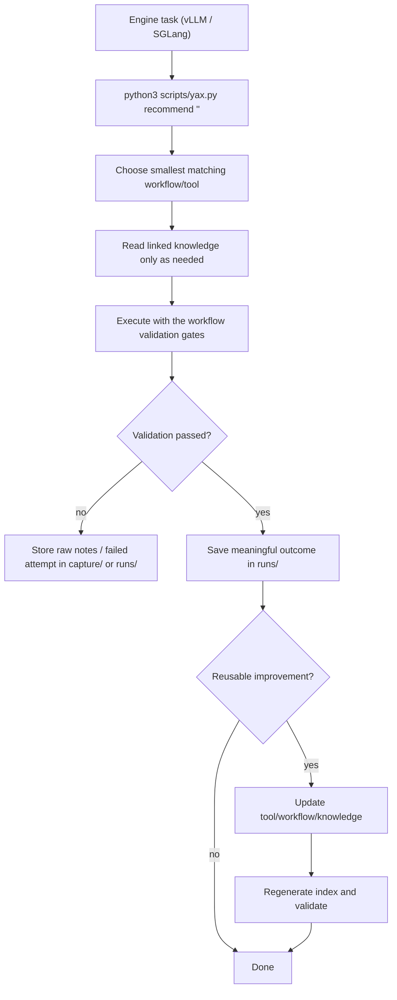

# YAX

YAX is a retrieval-first **LLM inference-engine engineering harness**: a compact
toolbox plus knowledge base for working on
[vLLM](https://github.com/vllm-project/vllm),
[SGLang](https://github.com/sgl-project/sglang), and
[ATOM](https://github.com/ROCm/ATOM) (AMD ROCm/AITER) as an inference-engine
developer and operator. It captures how to read and edit each codebase, what
features exist today, and which engine arguments and environment variables matter
on CUDA and ROCm.

Engines are first-class: knowledge lives under `knowledge/<engine>/`, and the
version-aware code map is per engine (`--engine vllm|sglang|atom`).

It borrows its harness shape from the Zootopia toolbox: markdown is the source of
truth, a small Python runtime makes search cheap, and instructions, knowledge,
verification, scope, and lifecycle are kept in the repo instead of chat memory.

## Toolbox Loop

```text
task -> retrieve tools/workflows -> execute with validation -> save run -> update toolbox
```



## How Agents Should Use It

1. Run `python3 scripts/yax.py recommend "<task>"` for any non-trivial task
   (vLLM or SGLang).
2. Read the top-ranked workflow first, then only the tools it references.
3. Follow linked `knowledge/<engine>/` (or `knowledge/shared/`) notes for deeper
   background (architecture, args, env vars, ROCm/CUDA specifics).
4. Execute with the workflow's validation gates (benchmark, accuracy check,
   `pytest`, smoke serve).
5. For meaningful tasks, record a run with
   `python3 scripts/yax.py new-run <slug>` and fill in the outcome.
6. If the run revealed a reusable improvement, update the narrowest artifact and
   regenerate the registry.

## Folders

```text
YAX/
├── AGENTS.md          # agent operating rules (read first)
├── README.md          # this file
├── scripts/yax.py     # toolbox runtime: recommend / search / validate / eval / index
├── templates/         # artifact templates
├── knowledge/         # compact knowledge library (namespaced by engine)
│   ├── vllm/          # vLLM: architecture, serving, rocm, cuda, development
│   ├── sglang/        # SGLang: architecture, RadixAttention, args, env, DSL, vs-vLLM
│   ├── atom/          # ATOM (ROCm): AITER ops, config, quant, distributed/TBO, vs-vLLM
│   └── shared/        # engine-agnostic: perf estimation (roofline) + perf factors
├── devmap/            # per-engine version-tagged code maps (vllm-*, sglang-*)
├── tools/             # tool cards, namespaced: tools/vllm/, tools/sglang/
├── workflows/         # workflows, namespaced: workflows/vllm/, workflows/sglang/
├── runs/              # task lineage records
├── capture/           # raw source / task notes inbox
├── evals/             # golden routing cases for retrieval-quality eval
├── registry/          # generated indexes (toolbox + per-engine code maps)
└── index/             # human entrypoint
```

## Runtime Commands

```bash
python3 scripts/yax.py recommend "serve a quantized model on 2 GPUs"
python3 scripts/yax.py where "preemption throughput collapse" -V 0.8.5  # version-aware code map
python3 scripts/yax.py where --list-areas                               # all code-map areas
python3 scripts/yax.py where "radix cache reuse" --engine sglang        # SGLang code map
python3 scripts/yax.py index          # rebuild registry (toolbox + per-engine code maps)
python3 scripts/yax.py validate       # check metadata + references
python3 scripts/yax.py eval           # retrieval/routing quality gate
python3 scripts/yax.py sync-status -e sglang  # which engine version YAX reflects + refresh
python3 scripts/yax.py new-run <slug> # scaffold a run record
```

### Keeping YAX Current

YAX records which upstream point each engine's knowledge reflects in
`devmap/<engine>-sync-state.json` (`synced_to`), with a human log in
`CHANGELOG.md`. To update, you only review commits **newer than the last sync**
rather than the whole history:

```bash
python3 scripts/yax.py sync-status --engine vllm   --repo-path <vllm-clone>
python3 scripts/yax.py sync-status --engine sglang --repo-path <sglang-clone>
python3 scripts/yax.py sync-status --engine atom   --repo-path <atom-clone>
# -> git log --oneline <synced_to>..origin/main
```

Then update the affected cards, bump `synced_to`, and add a CHANGELOG entry.

### Develop-By-Version Code Map

YAX helps develop vLLM and SGLang. Because each tree moves between releases
(vLLM's V0→V1 relocation; SGLang's pre/post-0.4 layout), `where` resolves the
right paths **for your engine + version tag**:

```bash
python3 scripts/yax.py where "scheduler decides which requests run" -V 0.7.3
#   -> vllm/core/scheduler.py        (vLLM V0 layout)
python3 scripts/yax.py where "scheduler decides which requests run" -V latest
#   -> vllm/v1/core/sched/scheduler.py  (vLLM V1 layout)
python3 scripts/yax.py where "radix attention prefix reuse" --engine sglang
#   -> python/sglang/srt/mem_cache/radix_cache.py
python3 scripts/yax.py where "two-batch overlap expert parallel" --engine atom
#   -> docs/distributed_guide.md + atom/distributed/ (ATOM, ROCm)
```

Source of truth is `devmap/<engine>-areas.jsonl` for each engine; the resolved
per-version indexes are generated to `registry/<engine>-codemap-by-version.json`.
Per-engine sync state lives in `devmap/<engine>-sync-state.json` (see
`python3 scripts/yax.py sync-status -e atom`).

## Design Principles

- Markdown is the source of truth; the registry JSON is rebuildable.
- Correctness and reproducible benchmarks outrank novelty.
- Pin versions: vLLM, PyTorch, CUDA/ROCm, and driver move fast; record them.
- Knowledge cards stay compact; deep dives link to upstream source files.
- Failed attempts stay in `runs/` or `capture/` unless they teach a reusable
  lesson.
- Treat YAX as an agent harness: keep instructions, state, verification, scope,
  and lifecycle explicit and repo-local.

## Scope And Accuracy Note

All engines evolve quickly. vLLM cards describe the **V1 engine era** (default
since 0.8.x); SGLang cards describe the **zero-overhead-scheduler era** (v0.4+);
ATOM cards describe **v0.1.x** (young, AMD-only, AITER-based — internal paths are
best-effort and link the authoritative `docs/` guides). Cards flag
version-sensitive behavior and tell you to confirm exact names against the
installed version:

- vLLM: `vllm serve --help`, `vllm/engine/arg_utils.py`, `vllm/envs.py`.
- SGLang: `python -m sglang.launch_server --help`,
  `python/sglang/srt/server_args.py`, `python/sglang/srt/environ.py`.
- ATOM: `python -m atom.entrypoints.openai_server --help`, and the authoritative
  `docs/` guides (ATOM is young; internal module paths are best-effort).

Sync baselines: see `devmap/<engine>-sync-state.json`.
