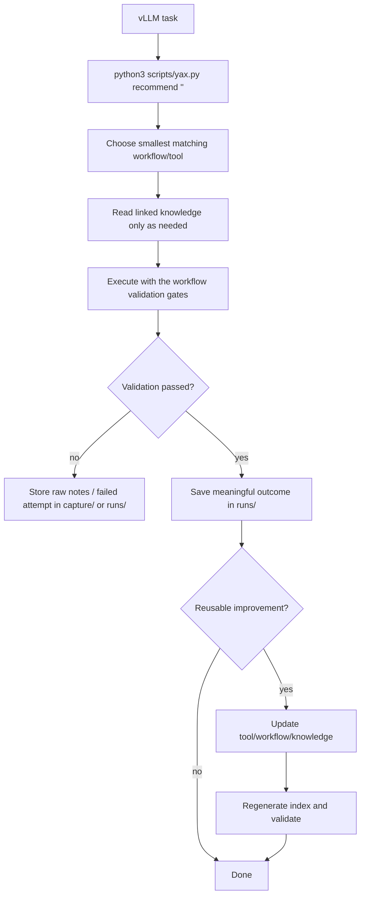

# YAX

YAX is a retrieval-first **LLM inference-engine engineering harness**: a compact
toolbox plus knowledge base for working on
[vLLM](https://github.com/vllm-project/vllm) and
[SGLang](https://github.com/sgl-project/sglang) as an inference-engine developer
and operator. It captures how to read and edit each codebase, what features exist
today, and which engine arguments and environment variables matter on CUDA and
ROCm.

Engines are first-class: knowledge lives under `knowledge/<engine>/`, and the
version-aware code map is per engine (`--engine vllm|sglang`).

It borrows its harness shape from the Zootopia toolbox: markdown is the source of
truth, a small Python runtime makes search cheap, and instructions, knowledge,
verification, scope, and lifecycle are kept in the repo instead of chat memory.

## Toolbox Loop

```text
task -> retrieve tools/workflows -> execute with validation -> save run -> update toolbox
```



## How Agents Should Use It

1. Run `python3 scripts/yax.py recommend "<task>"` for any non-trivial vLLM task.
2. Read the top-ranked workflow first, then only the tools it references.
3. Follow linked `knowledge/` notes for deeper background (architecture, args,
   env vars, ROCm/CUDA specifics).
4. Execute with the workflow's validation gates (benchmark, accuracy check,
   `pytest`, smoke serve).
5. For meaningful tasks, record a run with
   `python3 scripts/yax.py new-run <slug>` and fill in the outcome.
6. If the run revealed a reusable improvement, update the narrowest artifact and
   regenerate the registry.

## Folders

```text
YAX/
├── AGENTS.md          # agent operating rules (read first)
├── README.md          # this file
├── scripts/yax.py     # toolbox runtime: recommend / search / validate / eval / index
├── templates/         # artifact templates
├── knowledge/         # compact knowledge library
│   ├── architecture/  # vLLM V1 engine internals, PagedAttention, scheduler
│   ├── serving/       # vLLM engine args, env vars, features, quant, perf
│   ├── rocm/          # ROCm/HIP build, AITER, FP8 fnuz, TunableOp
│   ├── cuda/          # CUDA build, FlashInfer, DeepGEMM, CUDA graphs, NCCL
│   ├── development/   # vLLM repo layout, build, add a model, testing, codebase map
│   └── sglang/        # SGLang architecture, RadixAttention, args, env, DSL, vs-vLLM
├── devmap/            # version-tagged code maps (vllm: areas.jsonl; sglang: sglang-*.jsonl)
├── tools/             # canonical tool cards (compact capabilities)
├── workflows/         # reusable multi-tool task plans
├── runs/              # task lineage records
├── capture/           # raw source / task notes inbox
├── evals/             # golden routing cases for retrieval-quality eval
├── registry/          # generated machine-readable index
└── index/             # human entrypoint
```

## Runtime Commands

```bash
python3 scripts/yax.py recommend "serve a quantized model on 2 GPUs"
python3 scripts/yax.py where "preemption throughput collapse" -V 0.8.5  # version-aware code map
python3 scripts/yax.py where --list-areas                               # all code-map areas
python3 scripts/yax.py index          # rebuild registry (toolbox + codemap-by-version)
python3 scripts/yax.py validate       # check metadata + references
python3 scripts/yax.py eval           # retrieval/routing quality gate
python3 scripts/yax.py sync-status    # which vLLM version YAX reflects + how to refresh
python3 scripts/yax.py new-run <slug> # scaffold a run record
```

### Keeping YAX Current

YAX records which upstream vLLM point its knowledge reflects in
`devmap/sync-state.json` (`synced_to`), with a human log in `CHANGELOG.md`. To
update, you only review commits **newer than the last sync** rather than the whole
history:

```bash
python3 scripts/yax.py sync-status --vllm-path <vllm-clone>
# -> git log --oneline <synced_to>..origin/main
```

Then update the affected cards, bump `synced_to`, and add a CHANGELOG entry.

### Develop-By-Version Code Map

YAX's focus is developing vLLM. Because the tree moves between releases (notably
the V0→V1 engine relocation), `where` resolves the right paths **for your version
tag**:

```bash
python3 scripts/yax.py where "scheduler decides which requests run" -V 0.7.3
#   -> vllm/core/scheduler.py        (vLLM V0 layout)
python3 scripts/yax.py where "scheduler decides which requests run" -V latest
#   -> vllm/v1/core/sched/scheduler.py  (vLLM V1 layout)
python3 scripts/yax.py where "radix attention prefix reuse" --engine sglang
#   -> python/sglang/srt/mem_cache/radix_cache.py
```

Source of truth is `devmap/areas.jsonl` (vLLM) and `devmap/sglang-areas.jsonl`;
the resolved per-version indexes are generated to
`registry/codemap-by-version.json` and `registry/sglang-codemap-by-version.json`.
Per-engine sync state lives in `devmap/sync-state.json` and
`devmap/sglang-sync-state.json` (see `python3 scripts/yax.py sync-status -e sglang`).

## Design Principles

- Markdown is the source of truth; the registry JSON is rebuildable.
- Correctness and reproducible benchmarks outrank novelty.
- Pin versions: vLLM, PyTorch, CUDA/ROCm, and driver move fast; record them.
- Knowledge cards stay compact; deep dives link to upstream source files.
- Failed attempts stay in `runs/` or `capture/` unless they teach a reusable
  lesson.
- Treat YAX as an agent harness: keep instructions, state, verification, scope,
  and lifecycle explicit and repo-local.

## Scope And Accuracy Note

vLLM evolves quickly. Cards describe the **V1 engine era** (default since vLLM
0.8.x) and flag where behavior is version-sensitive. Always confirm exact flag
names against the installed version (`vllm serve --help`) and the source of
truth in `vllm/engine/arg_utils.py` and `vllm/envs.py` before relying on a
detail.
