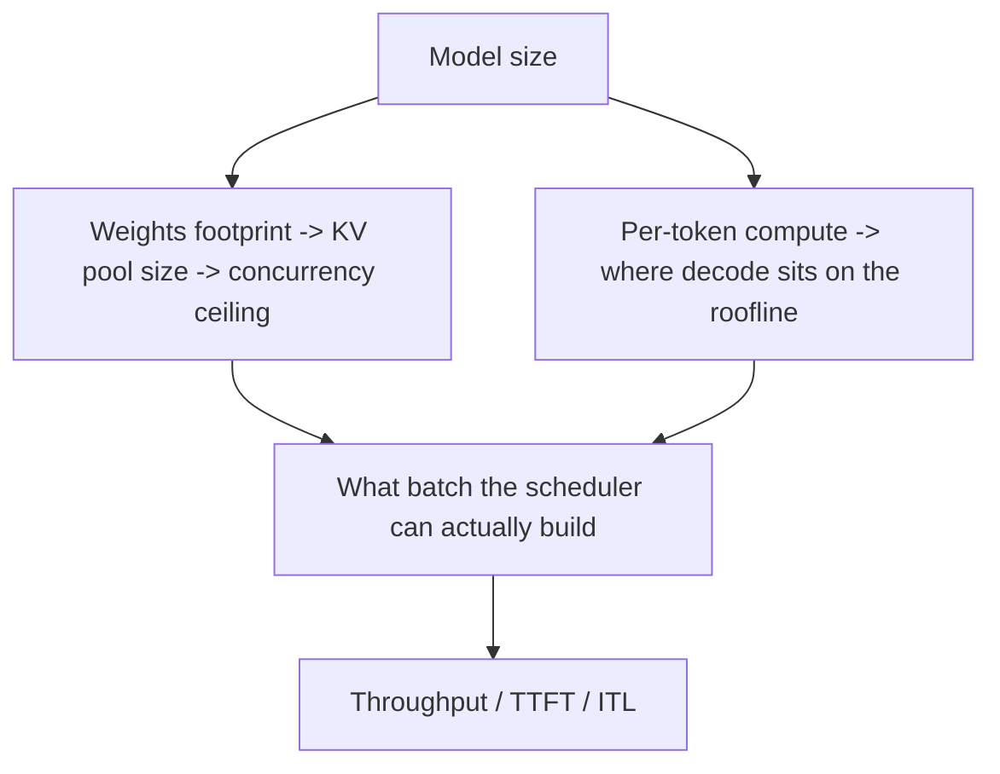

# How The Scheduler Affects Models Of Different Sizes

## Use When

Use when reasoning about why the same scheduler settings behave very differently
on a small vs medium vs large model, when tuning per model size, or when asked
whether scheduling can change a model's output.

## Lesson

The scheduler does **not** change the model's math. It changes the **batch
composition each step**: how many sequences run, and how the per-step token
budget is split between prefill (prompt) and decode (one token/seq). That batch
composition moves the model to a different point on its
**compute-vs-memory-bandwidth roofline**, and it competes with the model
**weights for VRAM**. Model size sets both the roofline shape and the leftover
KV-cache budget, so the *same* scheduler knobs land very differently by size.

Two coupling channels:

1. **Memory coupling.** `KV pool ≈ (VRAM * gpu_mem_util) - weights - activations`.
   Bigger weights → smaller KV pool → lower achievable concurrency. The scheduler
   can only fill seats that memory allows; on big models memory is the binding
   constraint, not `--max-num-seqs`.
2. **Compute coupling.** Decode is memory-bandwidth bound (must reload all
   weights per step regardless of batch size); batching amortizes that weight
   load across sequences. Prefill is compute bound. How "spare" the GPU is at
   batch size 1 depends on model size.

### Small Model (≈ <= 3B, fits with lots of spare VRAM)

- **Binding limit: concurrency caps, not memory.** KV pool is huge, so you can
  hold hundreds of sequences. `--max-num-seqs` (and sometimes batched-tokens) is
  what caps you — the default may *under-utilize* the GPU.
- **Decode is launch-overhead + bandwidth bound.** Per-token compute is tiny, so
  at low batch the GPU idles between kernel launches. **CUDA graphs matter most
  here**; `--enforce-eager` hurts small models the most.
- **Batching pays off hugely.** Doubling batch barely raises step latency but
  doubles throughput until you saturate bandwidth.
- **Prefill is cheap**, so chunked prefill rarely needed for throughput; large
  `--max-num-batched-tokens` is fine.
- **Tune:** raise `--max-num-seqs` aggressively (e.g. 256–1024) and
  `--max-num-batched-tokens`; keep CUDA graphs on. Watch GPU util, not memory.

### Medium Model (≈ 7B–34B, one GPU or small TP)

- **Balanced regime:** both concurrency and the token budget bind, depending on
  context length. KV pool is moderate; long contexts start to pressure it.
- **Chunked prefill sweet spot.** Interleaving prefill chunks with decodes keeps
  TTFT low without starving throughput — this is where tuning
  `--max-num-batched-tokens` has the biggest quality-of-service payoff.
- **Preemption appears** under high concurrency + long prompts; recompute cost is
  moderate.
- **Tune:** moderate `--max-num-seqs` (e.g. 64–256), set batched-tokens to balance
  TTFT vs throughput, consider `--kv-cache-dtype fp8` to lift concurrency.

### Large Model (≈ 70B+, multi-GPU TP/PP, often quantized)

- **Binding limit: memory, then communication.** Weights dominate VRAM, leaving a
  **small KV pool → low concurrency ceiling**. Raising `--max-num-seqs` does
  nothing if memory can't seat them; you hit "cannot fit max_model_len" or
  constant preemption instead.
- **Decode is compute bound** and crosses **TP collectives every layer**; tiny
  batches still pay full communication latency, so per-step overhead is high.
- **Prefill is very expensive.** A single long prompt can monopolize a step and
  stall every other request's decode → **chunked prefill is essential**, and
  `--max-num-batched-tokens` must be *smaller* to bound decode latency.
- **Preemption is costly:** recomputing the prefill of a long prompt on a 70B
  model is expensive, and swapping KV moves large blocks. Prefer **fewer
  sequences** over risking preemption churn.
- **PP adds pipeline bubbles:** throughput needs enough in-flight requests to keep
  all stages busy; too few sequences (because KV is tight) starves the pipeline.
- **Tune:** modest `--max-num-seqs`, smaller `--max-num-batched-tokens`, FP8 KV
  and/or weight quantization to grow the KV pool, lower `--max-model-len` to what
  you need, and consider speculative decoding to cut single-stream latency.

### Quick Comparison

| Aspect | Small (<=3B) | Medium (7–34B) | Large (70B+) |
| --- | --- | --- | --- |
| Binding constraint | seq/batch caps | mixed | KV memory, then comms |
| Decode bottleneck | launch + bandwidth | bandwidth | compute + TP comms |
| KV pool | huge | moderate | small |
| Chunked prefill | optional | high value | essential |
| `--max-num-seqs` | high | medium | low |
| `--max-num-batched-tokens` | large | balanced | smaller |
| CUDA graphs impact | largest | large | present |
| Preemption cost | cheap | moderate | expensive — avoid |

## Does Scheduling Change The Output?

Semantically, no: vLLM aims for **batch-invariant** results — a request's tokens
should not depend on who it was batched with. Caveats an engineer should know:

- **Numerical non-determinism.** Different batch shapes can change reduction order
  / kernel selection, producing tiny floating-point differences that, with
  greedy decoding near a tie, can flip a token. This is a numerics artifact, not
  a scheduling bug.
- **Chunked prefill** splits a prompt's attention into chunks; correct backends
  produce equivalent results, but a buggy backend can diverge — A-B chunked vs
  full prefill if you suspect it.
- **Preemption + recompute** must reproduce the same KV; if output changes after a
  preemption event, that is a real bug, not expected behavior.

So "the scheduler affects the model" is true for **performance and FP-level
determinism**, and should be false for **semantic correctness**.

## Rules

- Diagnose the binding constraint first: small → raise concurrency; large → grow
  KV pool (FP8 KV, quantize, lower max-model-len) before touching `--max-num-seqs`.
- Scale `--max-num-batched-tokens` *down* as the model grows to protect decode
  latency; scale it up on small models for throughput.
- On big models, treat preemption as a red flag — reduce concurrency rather than
  push utilization to 1.0.
- Keep CUDA graphs on everywhere, but know the win is largest on small models.
- Always benchmark per size; do not port a small-model config to a 70B.

## Avoid

- Raising `--max-num-seqs` on a large model to "get throughput" when memory is the
  limit — it just causes preemption.
- Using one large `--max-num-batched-tokens` across all sizes; it spikes decode
  latency on big models.
- Blaming the scheduler for token differences that are FP non-determinism.

## Related

- `knowledge/architecture/scheduler-batching.md`
- `knowledge/architecture/paged-attention-kv-cache.md`
- `knowledge/serving/performance-tuning.md`
- `tools/debugging/oom-kv-triage.md`

## Source

- `vllm/v1/core/sched/scheduler.py`
- `knowledge/architecture/scheduler-batching.md`
- https://docs.vllm.ai/en/latest/performance/optimization.html
