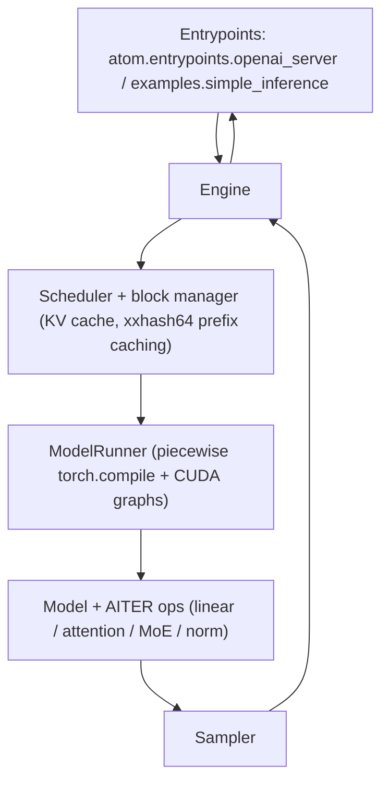

# ATOM Architecture

## Use When

Use to understand how ATOM is structured, where to change behavior, and how a
request flows from API to GPU. ATOM is a lightweight, vLLM-like engine adapted
from nano-vllm, so it is smaller and simpler than vLLM/SGLang.

## Lesson

ATOM ("AiTer Optimized Model") is an AMD-ROCm inference engine whose value is
tight integration with **AITER** kernels (ASM/CK/Triton). It keeps the familiar
serving-engine shape but stays small.

### Component Map (best-effort; see docs/architecture_guide.md)

- **Entrypoints** (`atom/entrypoints/`): OpenAI-compatible server + offline
  `examples.simple_inference`. Also `/start_profile` and `/stop_profile`.
- **Engine** (`atom/engine/`, verify): scheduler, block manager / KV cache,
  model runner — nano-vllm-derived.
- **Model ops** (`atom/layers/`): AITER-backed linear/attention/MoE/norm wrappers
  (`docs/model_ops_guide.md`). This is ATOM's distinctive layer.
- **Models** (`atom/models/`): one file per HF architecture; auto-detected.
- **Config** (`atom/config.py` / configuration guide): config classes + CLI.

### Request Lifecycle

1. Entrypoint receives the request; config + sampling params resolved.
2. Scheduler admits requests and allocates KV blocks; **xxhash64-based prefix
   caching** reuses blocks across sequences with shared prefixes.
3. ModelRunner runs the forward under **piecewise torch.compile** (4 levels;
   default 3) with CUDA-graph capture for low-latency decode.
4. AITER kernels execute linear/attention/MoE/norm; sampler emits tokens.
5. Outputs stream back via the OpenAI API.

### Distinctive Design Points

- **AITER-first**: kernels are the point; see `aiter-model-ops.md`.
- **Two-Batch Overlap (TBO)** for MoE/EP (DeepSeek-style comp/comm overlap).
- **P/D disaggregation** with RDMA KV transfer (MORI-IO / Mooncake).
- **vLLM plugin backend**: ATOM can also run as an out-of-tree backend for vLLM.

## Rules

- Read `docs/architecture_guide.md` first — it is authoritative and ATOM's
  internals move fast.
- Scheduling/KV changes → `atom/engine/` + `docs/scheduling_kv_cache_guide.md`.
- Kernel/op changes → `atom/layers/` + `docs/model_ops_guide.md` (and AITER).
- Model math → `atom/models/<arch>.py` + `docs/model_support_guide.md`.

## Avoid

- Assuming vLLM internals map 1:1; ATOM is nano-vllm-derived and much smaller.
- Treating module paths here as fixed — verify against the checkout.

## Related

- `knowledge/atom/aiter-model-ops.md`
- `knowledge/atom/distributed-tbo.md`
- `knowledge/atom/vllm-vs-atom.md`
- `devmap/atom-areas.jsonl`

## Source

- `docs/architecture_guide.md`, `atom/` in the repo
- https://github.com/ROCm/ATOM
