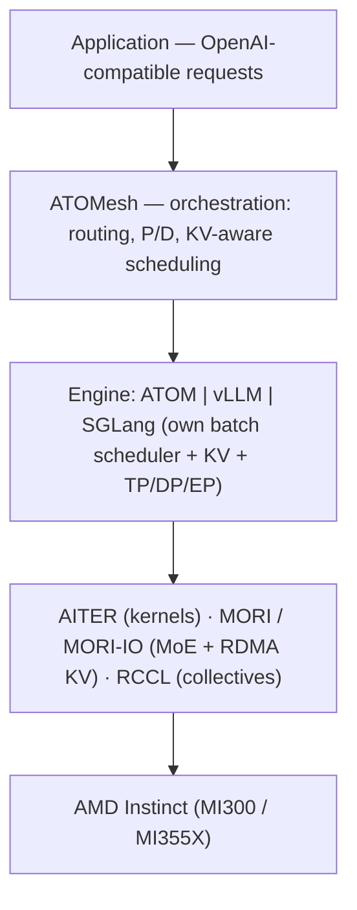

# ATOMesh Orchestration (Cluster Control Plane)

## Use When

Use when scaling ATOM/vLLM/SGLang across a cluster on AMD Instinct GPUs, doing
prefill/decode (P/D) disaggregation, KV-aware request routing, or reasoning about
the difference between *cluster-level* and *engine-level* scheduling. ATOMesh is
**alpha** (early evaluation, not production).

## Lesson

**ATOMesh is an orchestration / control-plane layer that sits *above* inference
engines** — a distributed inference gateway. It does not execute models itself;
it routes and schedules requests across a cluster and **delegates execution to a
backend engine**. It is AMD's ROCm-native analog of NVIDIA Dynamo / llm-d /
Mooncake-style disaggregated serving.

### Two Scheduling Levels (the key idea)

1. **Cluster-level = ATOMesh**: request routing, **P/D disaggregation**,
   **KV-/cache-aware placement**, worker health, retries, scaling, observability.
2. **Engine-level = the backend**: ATOM, vLLM, or SGLang each keep their own
   in-engine batch scheduler, KV cache, and TP/DP/EP execution.

So a request is placed by ATOMesh, then batched/executed by the chosen engine's
own scheduler. Don't conflate the two.

### The 5-Layer Stack

### Backend-Neutral Delegation

ATOMesh routes to:

- **ATOM** — the primary ROCm-native execution path.
- **vLLM** / **SGLang** — via their *native runners*, **or** via **ATOM plugin
  runners** (`vLLM-ATOM`, `SGLang-ATOM`) to get AMD-optimized execution under a
  familiar serving interface.

Mechanics:

- **Unified placement core** — transport-neutral worker selection that returns
  *either* one worker (regular) *or* a **prefill+decode worker pair**
  (disaggregated). Wire formats isolated behind per-backend **adapters**
  (ATOM/vLLM/SGLang) so engines evolve independently.
- **Worker pools per backend**, split into regular and P/D pools, with warmup
  traffic (build KV state), health exclusion, and lazy-delete draining kept off
  the hot path.
- **Fixture-driven mock-worker framework** — test routing (HTTP/gRPC,
  regular/P-D, streaming, failures) **without GPUs or weights**; good for CI and
  agent-assisted dev.
- Serving-layer **observability** (Prometheus facade, normalized route/labels).

### Strategy

Prove "speed-of-light" disaggregation recipes in ATOM + ATOMesh, then **upstream
to vLLM/SGLang via plugin mode** (SGLang-ATOM, vLLM-ATOM). Perf shown on
InferenceX with **DeepSeek-V4-Pro on MI355X** (e.g. 3-node 1P2D, EP8).

## Rules

- Put cluster-serving policy (routing, P/D, KV-aware placement, lifecycle,
  scaling) in ATOMesh; keep model execution in the engine. Changing routing
  should not require editing the GPU execution path.
- For long-context / prefill-heavy clusters, prefer P/D disaggregation + KV-aware
  placement so prefill and decode pools scale independently.
- To get ATOM's kernels under an existing vLLM/SGLang deployment, use the
  ATOM plugin runner path rather than re-platforming.
- Treat ATOMesh as alpha: evaluate/architect with it; don't ship production on it
  yet.

## Avoid

- Calling ATOMesh a "fourth engine" — it is a control plane over engines.
- Confusing ATOMesh routing with an engine's batch scheduler (two distinct tiers).
- Assuming ATOMesh replaces AITER/MORI/RCCL; it sits above and connects them.

## Related

- `knowledge/atom/distributed-tbo.md` (engine-level TP/DP/EP, TBO, P/D transport)
- `knowledge/atom/architecture.md`
- `knowledge/atom/vllm-vs-atom.md`
- `knowledge/sglang/architecture.md`, `knowledge/vllm/architecture/scheduler-batching.md`

## Source

- ATOMesh: https://rocm.blogs.amd.com/software-tools-optimization/atomesh-inference/README.html
- ATOM engine: https://rocm.blogs.amd.com/software-tools-optimization/atom-inference-engine/README.html
- MI355X distributed inference: https://www.amd.com/en/developer/resources/technical-articles/2026/distributed-inference-performance-on-instinct-mi355x-gpu.html
- Repo: https://github.com/ROCm/ATOM ; related: AITER, MORI, RCCL; ecosystem analogs: NVIDIA Dynamo, llm-d, Mooncake
