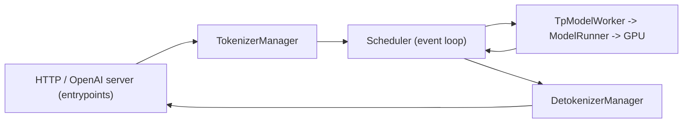

# SGLang Architecture

## Use When

Use to understand how SGLang is structured, where to add or change behavior, and
how a request flows from API to GPU.

## Lesson

SGLang has two halves:

- **SRT (SGLang Runtime)** — `python/sglang/srt/`: the serving backend (scheduler,
  KV cache, model execution, attention, the HTTP/OpenAI server).
- **Frontend language** — `python/sglang/lang/` + `python/sglang/api.py`: a Python
  DSL for programming multi-call LLM programs (`sgl.gen`, `sgl.select`, `fork`).
  See `frontend-language.md`. vLLM has no equivalent.

### Multi-Process Design

SGLang splits the server into processes that communicate over **ZMQ**, so Python
work on one stage overlaps GPU work on another:

- **TokenizerManager** (`srt/managers/tokenizer_manager.py`): tokenizes, validates,
  routes requests in.
- **Scheduler** (`srt/managers/scheduler.py`): the core loop. Forms batches
  (`schedule_batch.py`) under a policy (`schedule_policy.py`), manages the KV
  pools and RadixAttention, and runs the **overlap scheduler** (CPU scheduling of
  step N+1 overlaps GPU compute of step N — the "zero-overhead batch scheduler").
- **TpModelWorker / ModelRunner** (`srt/managers/tp_worker.py`,
  `srt/model_executor/model_runner.py`): own the GPU, build the `ForwardBatch`,
  run the model under CUDA graphs.
- **DetokenizerManager**: incremental detokenization + streaming back out.
- **Data parallel**: a `DataParallelController` fans requests across replicas.

### Request Lifecycle

1. HTTP/OpenAI entrypoint receives the request; TokenizerManager tokenizes.
2. Scheduler admits it, matches its prefix against the **RadixCache** (reusing KV
   blocks), allocates KV from the token pool.
3. Each step the scheduler builds a batch (prefill/extend + decode), overlapping
   CPU prep with the previous GPU step.
4. ModelRunner runs the forward (attention backend reads/writes KV); the sampler
   produces tokens (with grammar masks / spec-decode as configured).
5. DetokenizerManager streams text out; finished requests free KV (kept in the
   radix tree for possible reuse).

### Parallelism

- **TP** (`--tp-size`), **DP** (`--dp-size`), **EP** (`--ep-size`,
  `--enable-dp-attention` for DeepSeek MoE). Multi-node via `--dist-init-addr`,
  `--nnodes`, `--node-rank`. Comms over NCCL/RCCL.

## Rules

- Scheduling/batching changes → `srt/managers/scheduler.py` + `schedule_*.py`.
- KV/prefix-reuse changes → `srt/mem_cache/` (see `radixattention.md`).
- Model math → `srt/models/<arch>.py`; attention kernels → `srt/layers/attention/`.
- Server/API surface → `srt/entrypoints/`; keep it thin.

## Avoid

- Confusing the frontend DSL (`sglang/lang`) with the runtime (`sglang/srt`) — most
  serving/engine work is in `srt`.
- Assuming a single-process design; debugging often means following ZMQ messages
  across processes.

## Related

- `knowledge/sglang/radixattention.md`
- `knowledge/sglang/server-args.md`
- `knowledge/sglang/vllm-vs-sglang.md`
- `devmap/sglang-areas.jsonl`

## Source

- `python/sglang/srt/` (managers, mem_cache, model_executor, entrypoints)
- https://docs.sglang.ai/ ; v0.4 blog (zero-overhead scheduler)
