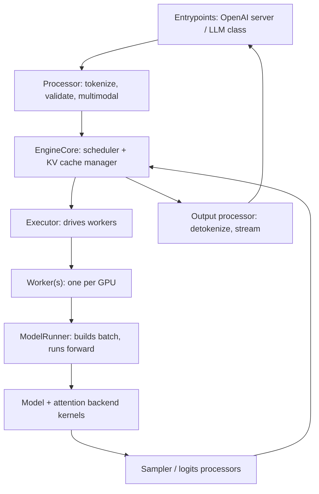

# vLLM Architecture Overview (V1 Engine)

## Use When

Use when you need a mental model of how vLLM is structured, where to add or
change behavior, or how a request flows from API to GPU and back.

## Lesson

vLLM is an inference engine for LLMs built around three ideas: **PagedAttention**
(non-contiguous KV cache in fixed blocks), **continuous batching** (per-step
admission of requests), and a clean separation between scheduling, model
execution, and serving. Since vLLM 0.8.x the **V1 engine** (`vllm/v1/`) is the
default; V0 is legacy. V1 is the assumed architecture here.

### Layered Component Map

- **Entrypoints** (`vllm/entrypoints/`): the `LLM` offline class, and the OpenAI
  compatible server (`vllm/entrypoints/openai/`) launched by `vllm serve`.
- **Engine** (`vllm/v1/engine/`): `LLMEngine` / `AsyncLLM` wrap `EngineCore`,
  which owns the `Scheduler` and the KV cache manager. `EngineCore` typically
  runs in its own process and communicates over ZMQ for low jitter.
- **Executor** (`vllm/v1/executor/`): fans work out to workers. Uniproc for one
  GPU; multiproc or Ray for tensor/pipeline parallel.
- **Worker / ModelRunner** (`vllm/v1/worker/`): each worker owns a GPU, holds the
  model and KV cache, builds the per-step batch, and runs the forward pass
  (often under CUDA graphs / `torch.compile`).
- **Model definitions** (`vllm/model_executor/models/`): one file per
  architecture; registered in the model registry.
- **Attention** (`vllm/v1/attention/` + `vllm/attention/`): backend-pluggable
  attention kernels (see `attention-backends.md`).

### Request Lifecycle (decode of one request)

1. Entrypoint receives the request; `Processor` tokenizes, applies chat template,
   and resolves sampling params / multimodal inputs.
2. `EngineCore` adds the request; the `Scheduler` decides which requests run this
   step (prefill, decode, or chunked prefill mix) within token and memory budget.
3. The KV cache manager allocates blocks; prefix caching may reuse existing
   blocks for shared prefixes.
4. The `ModelRunner` builds a flattened batch and runs one forward step; the
   attention backend reads/writes KV blocks.
5. The `Sampler` produces next tokens (with logits processors / guided decoding /
   spec-decode verification as configured).
6. Outputs are detokenized and streamed; finished requests free their blocks.
7. Repeat until each request hits a stop condition or `max_tokens`.

### Process / Parallelism Model

- **Tensor parallel (TP)**: shards each layer across GPUs; set
  `--tensor-parallel-size`.
- **Pipeline parallel (PP)**: splits layers into stages; set
  `--pipeline-parallel-size`. Good across nodes / slower interconnect.
- **Data parallel (DP)**: replicas, used especially with expert parallel for MoE;
  `--data-parallel-size`.
- **Expert parallel (EP)**: shard MoE experts; `--enable-expert-parallel`.
- Workers communicate via NCCL (CUDA) / RCCL (ROCm); a custom all-reduce is used
  for small messages when available.

## Rules

- To change *what runs when*, edit the scheduler (`vllm/v1/core/sched/`).
- To change *how a model computes*, edit its file in
  `vllm/model_executor/models/` and/or the layers it uses.
- To change *attention math/kernels*, work in the attention backends.
- To change *memory/block behavior*, edit the KV cache manager.
- Keep the entrypoint/serving layer thin; business logic belongs in the engine.

## Avoid

- Assuming V0 internals; confirm you are on V1 (default). `VLLM_USE_V1=0` forces
  legacy V0 and is being removed.
- Putting heavy per-request Python work on the hot path; it shows up as low GPU
  utilization.

## Related

- `knowledge/vllm/architecture/paged-attention-kv-cache.md`
- `knowledge/vllm/architecture/scheduler-batching.md`
- `knowledge/vllm/architecture/attention-backends.md`
- `knowledge/vllm/development/repo-layout-and-build.md`

## Source

- `vllm/v1/` (engine core, scheduler, worker, executor, attention)
- https://docs.vllm.ai/en/latest/design/arch_overview.html
